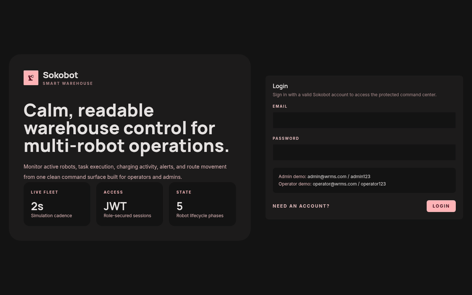

<p align="center">
  
</p>

<h1 align="center">Sokobot</h1>

<p align="center">
  <em>A production-oriented Warehouse Robot Management System.</em>
</p>

<p align="center">
  <a href="https://github.com/gaminization/sokobot/blob/main/LICENSE"></a>
  <a href="https://python.org"></a>
  <a href="https://nodejs.org"></a>
  <a href="https://fastapi.tiangolo.com/"></a>
  <a href="https://react.dev/"></a>
</p>

---

## 🌟 Overview

**Sokobot** is a robust, production-ready web platform for managing and simulating autonomous warehouse robots. Built with a modern technology stack, it provides a comprehensive command-center UI, real-time analytics, and a powerful backend engine for task allocation, routing, and lifecycle management.

### ✨ Key Features

- **🛡️ Secure Access:** Role-based access control (RBAC) with secure JWT authentication.
- **🤖 Robot Management:** Full lifecycle tracking from `IDLE` to `EXECUTING` and `CHARGING`.
- **🚦 Intelligent Allocation:** Auto-assignment algorithms that dispatch the nearest idle robot with sufficient battery.
- **📊 Real-time Dashboard:** Live operational snapshot, KPIs, and warehouse map visualization.
- **⚡ Background Simulation Engine:** Built-in processing for robot movement, task progression, and error recovery.

---

## 🏗️ Architecture & Modules

The platform is divided into robust, clearly defined modules:

### ⚙️ Backend (`/backend`)
A high-performance FastAPI application featuring:
- JWT Authentication & RBAC (`Admin` and `Operator` roles)
- Advanced Task Queuing & Auto-allocation
- Robot Simulation & Lifecycle Tracking
- Alembic database migrations

### 💻 Frontend (`/frontend`)
A sleek, responsive command-center built with React, Vite, and Tailwind CSS. It is deeply integrated with the live API to provide an uninterrupted view of the warehouse floor.

### 📚 Documentation (`/docs`)
Includes original system requirements (SRS), storyboards, and comprehensive UML/DFD/ER diagrams acting as the project's source of truth.

---

## 🚀 Quick Start

Getting Sokobot running locally is fast and straightforward.

### 1. Prerequisites
- **Python 3.10+**
- **Node.js 20+**
- **PostgreSQL 14+** (Recommended)

### 2. Launching the Backend

```bash
pip install -r backend/requirements.txt
alembic -c backend/alembic.ini upgrade head
uvicorn backend.main:app --reload
```

### 3. Launching the Frontend

```bash
cd frontend
npm install
npm run dev
```

For detailed configuration (including Docker and database setups), please refer to the [**Installation Guide**](./INSTALL.md).

---

## 🔐 Default Credentials

To get you started instantly, the system seeds default accounts:

| Role | Email | Password |
| :--- | :--- | :--- |
| **Admin** | `admin@wrms.com` | `admin123` |
| **Operator** | `operator@wrms.com` | `operator123` |

---

## 📖 Comprehensive Documentation

Explore our dedicated guides to master the Sokobot platform:

- 🛠️ [**Installation & Setup**](./INSTALL.md)
- 🔌 [**API Reference**](./API_DOCS.md)
- 🤝 [**Contributing Guidelines**](./CONTRIBUTING.md)
- 📜 [**Changelog**](./CHANGELOG.md)
- 🗺️ [**Roadmap**](./ROADMAP.md)

You can also access the live OpenAPI Swagger UI by navigating to `http://localhost:8000/docs` while the backend is running.

---

## 🧪 Testing & Validation

We maintain high code quality with rigorous testing:

```bash
# Backend Testing
pytest -q

# Frontend Build & Verification
cd frontend && npm run build
```

---

<p align="center">
  Made with ❤️ for Sokobot - Warehouse Robot Management System. 
  <br/>
  <a href="./SECURITY.md">Security</a> • <a href="./CODE_OF_CONDUCT.md">Code of Conduct</a>
</p>
